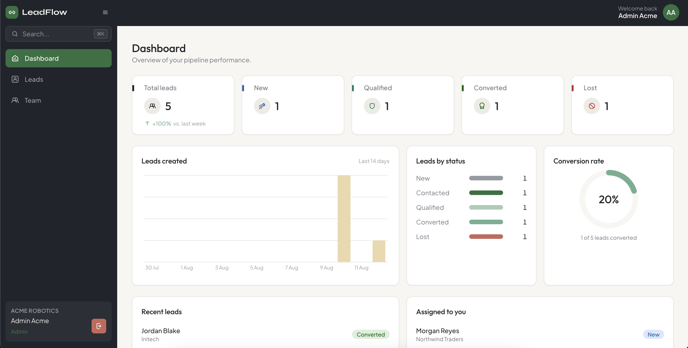
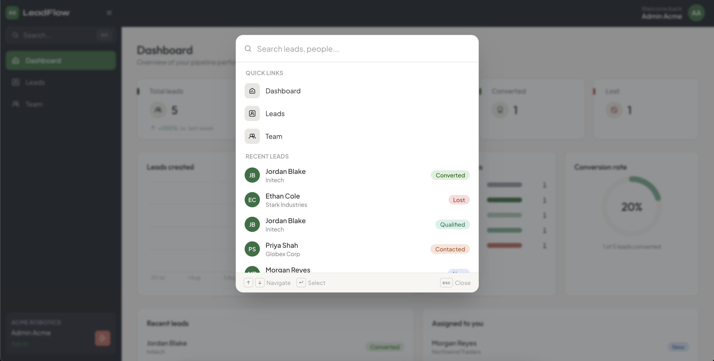
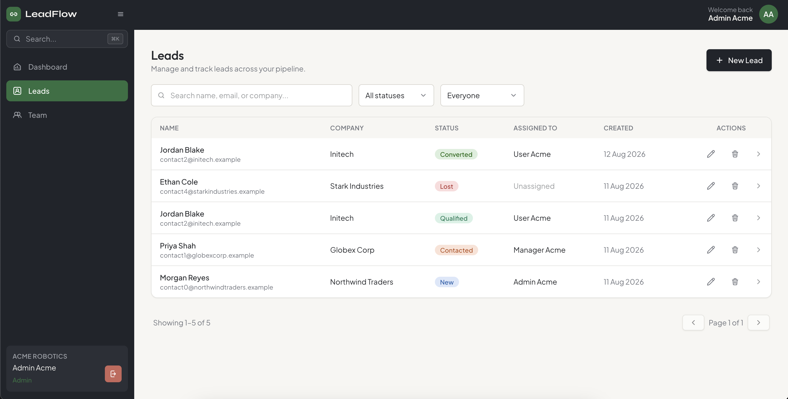
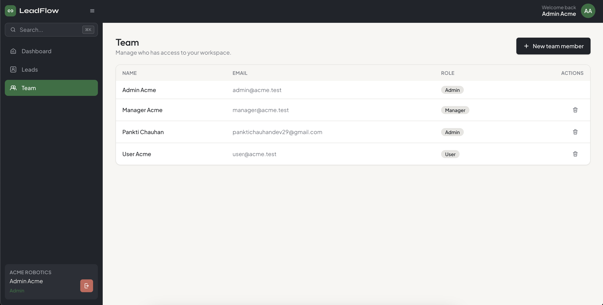
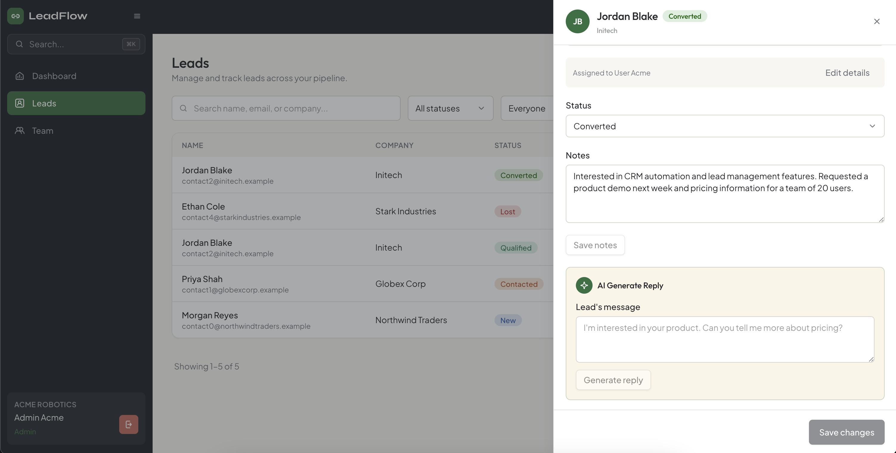

# LeadFlow

A multi-tenant mini CRM with an AI lead assistant. Two (or more) companies share
one deployment, each with its own users and leads - one company can never see
or touch another's data, even by hand-editing an ID in a request.

Built for the "Multi-Tenant Mini CRM with AI Lead Assistant" take-home
assignment (Next.js + TypeScript + Node.js + MongoDB).

## Contents

- [Screenshots](#screenshots)
- [Architecture](#architecture)
- [Tech stack](#tech-stack)
- [Data model](#data-model)
- [Tenant isolation & security](#tenant-isolation--security)
- [Authentication & authorization](#authentication--authorization)
- [AI integration](#ai-integration)
- [Redis caching (bonus)](#redis-caching-bonus)
- [Google OAuth (bonus)](#google-oauth-bonus)
- [Error handling](#error-handling)
- [Scalability considerations](#scalability-considerations)
- [Setup & run](#setup--run)

## Screenshots

| | |
|---|---|
| **Dashboard** - stats, leads-by-status, conversion rate, 14-day trend | **Command palette (⌘K)** - quick navigation and lead search |
|  |  |
| **Leads** - search, status/assignee filters, pagination | **Team** - role management (Admin/Manager/User) |
|  |  |

**Lead detail** - notes, status update, and AI Generate Reply



## Architecture

```
Route Handler (src/app/api/**)
  → parses & validates the request with Zod, calls a service, shapes the response
       ↓
Middleware wrappers (src/server/middlewares/withAuth.ts, withRole.ts)
  → verify the session JWT from the httpOnly cookie, attach
    ctx = { userId, companyId, role } - never trust client-supplied ids
       ↓
Service layer (src/server/services/*)
  → business logic + RBAC rules; every DB call is scoped with ctx.companyId
       ↓
Mongoose models (src/models/*)
```

Routes stay thin (parse → call service → respond). Services hold every rule
about *who can do what to which tenant's data*, so that rule exists exactly
once instead of being re-implemented per route. `src/proxy.ts` (Next.js 16
renamed `middleware.ts` → `proxy.ts`) only handles page-level redirects for UX
- it is explicitly **not** the security boundary; every API route
independently re-verifies the session and re-scopes every query.

### Project layout

```
src/
  app/
    (auth)/login/                 unauthenticated route group
    (dashboard)/{dashboard,leads,users}/   authenticated route group + shell
    api/                          route handlers (the REST API)
  components/
    common/                       reusable UI primitives (Button, Modal, Table, ...)
    layout/                       Sidebar, Topbar, DashboardShell
    leads/, dashboard/, users/, auth/   feature components composed from common/
  lib/
    auth/                         password hashing, JWT sign/verify, session cookie
    ai/                           AIProvider interface + OpenAI/mock implementations
    validations/                  Zod schemas (shared by API routes and forms)
    db/connect.ts, redis.ts, rateLimit.ts, apiClient.ts
  server/
    middlewares/                  withAuth, withRole
    services/                     leadService, userService, authService, dashboardService
    http.ts                       jsonOk/jsonError/parseJsonBody helpers, HttpError
  models/                         Mongoose schemas (Company, User, Lead)
  store/                          Zustand stores (auth session, UI/toasts)
  hooks/                          data-fetching hooks (useLeads, useDashboardStats, ...)
  types/                          shared TS types + the ApiResult envelope
  proxy.ts                        page-level auth redirect (UX only)
scripts/seed.ts                   seeds 2 tenants with all 3 roles + sample leads
docker-compose.yml                local MongoDB + Redis
```

## Tech stack

| Concern | Choice | Why |
|---|---|---|
| Framework | Next.js 16 (App Router, Turbopack) | One deployable for both the React frontend and the Node API (Route Handlers) |
| Language | TypeScript, strict mode | Compiler catches tenant-id/role mistakes before runtime |
| Database | MongoDB + Mongoose | Matches the assignment's recommended stack; schemas + indexes double as documentation |
| Auth | Hand-rolled JWT (`jose`) in an httpOnly cookie + `bcryptjs` | The assignment wants visible, understandable authN/authZ - not a black-box library |
| Validation | Zod | One schema reused for API input validation *and* client-side form validation |
| Client state | Zustand | Only for genuine client state (session, toasts) - server data is fetched per-page, not duplicated into a global store |
| Forms | React Hook Form + `@hookform/resolvers/zod` | Type-safe forms without re-deriving validation |
| Cache | ioredis | Optional GET /api/leads cache (bonus) |
| AI | `openai` SDK behind an `AIProvider` interface | Swappable; falls back to a deterministic mock automatically |

## Data model

```
Company 1 ──< User (companyId)
Company 1 ──< Lead (companyId)
User    1 ──< Lead (assignedUserId, nullable)
```

- **Company**: `{ name, slug, createdAt }`
- **User**: `{ companyId, name, email (globally unique), passwordHash, role, createdAt }`.
  Email is unique across the whole system (not just per-tenant) so a single
  `POST /api/auth/login` with just email + password can resolve both the user
  *and* their tenant.
- **Lead**: `{ companyId, name, email, phone, company, status, assignedUserId,
  notes, createdAt, updatedAt }`. `status` is one of `New, Contacted, Qualified,
  Converted, Lost`.
- Indexes: `{companyId, status}`, `{companyId, assignedUserId}`,
  `{companyId, createdAt}` - every list/filter query the API supports is
  covered by a compound index that leads with `companyId`.

## Tenant isolation & security

The guarantee the assignment asks for - *"a user from Company A must never
access Company B's data, even by manually changing an ID"* - is implemented
at the data-access layer, not the UI:

1. On login, the server looks up the user, verifies the password, and signs a
   JWT containing `{ sub: userId, companyId, role }`. This token is the
   **only** source of `companyId` and `role` for every subsequent request -
   the client never sends either as a parameter that's trusted.
2. `withAuth` (`src/server/middlewares/withAuth.ts`) verifies that JWT on
   every protected route and passes the decoded `ctx` to the handler.
3. Every service function takes `ctx` and includes `companyId: ctx.companyId`
   in its Mongo filter. `getLeadById`, `updateLead`, and `deleteLead` all
   query `{ _id: id, companyId: ctx.companyId }` - if the id belongs to
   another tenant, the query simply returns nothing.
4. On a miss, the API returns **404, not 403** - it doesn't confirm whether
   the resource exists in someone else's tenant, it just says "not found."

This was verified end-to-end (see [Setup & run](#setup--run) for how to
reproduce): logging in as an admin in Company A and requesting a Company B
lead ID directly against the API returns `404`, and a `DELETE` against it is
also `404` - the record is untouched.

Additional hardening baked in:

- `bcryptjs` with cost factor 12 for password hashing.
- Every API input is parsed with a Zod schema using `.strict()` - unknown
  fields are rejected outright, not silently dropped.
- Every `:id` route param is validated as a Mongo ObjectId *before* it
  reaches a query, so a malformed id 400s instead of throwing a cast error.
- Session cookie is `httpOnly`, `sameSite=lax`, `secure` in production, and
  short-lived (2h).
- A simple in-memory fixed-window rate limiter guards `POST /api/auth/login`
  (10 attempts/minute per IP). Documented as best-effort: it's per-instance,
  so a multi-instance deployment should move it into Redis (same connection
  already used for the leads cache) via `INCR` + `EXPIRE`.
- `.env` is gitignored; `.env.example` documents every variable; no secret
  ever appears in client-shipped code (see [AI integration](#ai-integration)).

## Authentication & authorization

**AuthN.** `POST /api/auth/login` verifies credentials and sets the session
cookie; `POST /api/auth/logout` clears it; `GET /api/auth/me` returns the
current session's user. `src/proxy.ts` redirects unauthenticated visitors away
from `/dashboard`, `/leads`, `/users` and redirects an already-authenticated
visitor away from `/login` - this is a UX nicety, re-verified independently by
every API route.

**AuthZ (RBAC).** Enforced in the service layer, not just hidden in the UI:

| Role | Leads: view | Leads: create/edit/delete | Users |
|---|---|---|---|
| Admin | all leads in the tenant | ✓ | full access, including creating users |
| Manager | all leads in the tenant | ✓ | can view the roster (to assign leads), can't create users |
| User | **only leads assigned to them** | can update `status`/`notes` on their own assigned leads only - nothing else | no access |

`leadService.listLeads` forces `assignedUserId = ctx.userId` into the query
whenever `ctx.role === "user"`, regardless of what the client asked for.
`updateLead` additionally rejects any field outside `{status, notes}` for that
role with a `403`, even if the lead *is* assigned to them - tested directly
against the API (see below), not just hidden in the form.

## AI integration

`POST /api/leads/:id/ai-reply` - protected by the same auth + tenant-scoped
lead lookup as everything else (a `user` role can only generate a reply for a
lead assigned to them).

```
src/lib/ai/
  types.ts           AIProvider.generateReply(message, context)
  openaiProvider.ts   real implementation via the OpenAI SDK
  mockProvider.ts      deterministic, templated fallback
  index.ts             factory: OpenAIProvider if OPENAI_API_KEY is set, else MockAIProvider
```

The API key is read from `process.env.OPENAI_API_KEY` **inside a server-only
module** (`src/lib/ai/openaiProvider.ts`) that is never imported by a client
component - it cannot end up in a browser bundle. The client only ever talks
to `/api/leads/:id/ai-reply`, never to OpenAI directly.

Without a key configured, the app automatically uses `MockAIProvider`, which
returns a deterministic, context-aware templated reply - the whole feature is
demoable and gradeable with zero external dependencies. Set
`OPENAI_API_KEY` in `.env` to switch to real completions (model
`gpt-4o-mini`) with no code changes.

## Redis caching (bonus)

`GET /api/leads` is cached per tenant and per query:

- **What's cached:** the paginated `{ items, page, pageSize, total, totalPages }`
  result for a given `(companyId, role, userId-if-role-is-user, search, status,
  assignedUserId, page, pageSize)` combination. Role/user are part of the key
  so a `user` role's narrower (assigned-only) result can never be served from
  an admin's cached full-tenant entry.
- **Expiration:** 60 second TTL.
- **Invalidation:** rather than deleting keys directly (which would require an
  unsafe `KEYS`/`SCAN` sweep on every write), each tenant has a version
  counter `leads:{companyId}:v`. Every cache key embeds the current version;
  `createLead`/`updateLead`/`deleteLead` all call `invalidateLeadsCache`,
  which just `INCR`s that counter. Every previously cached entry for that
  tenant instantly becomes unreachable and expires naturally via its TTL -
  no bulk delete needed.
- **Fails open:** `src/lib/redis.ts` returns `null` from every helper if
  `REDIS_URL` isn't set or the connection errors - `GET /api/leads` behaves
  identically (just uncached) with no Redis available. This was verified by
  hitting the endpoint twice (`X-Cache: MISS` then `HIT`), writing a lead,
  and confirming the next request is `MISS` again.

## Google OAuth (bonus)

Implemented as **Authorization Code + PKCE**, structured to be multi-provider
even though only Google is wired up today.

1. `GET /api/auth/oauth/:provider/start` (`src/app/api/auth/oauth/[provider]/start/route.ts`)
   generates a `code_verifier` + `code_challenge` (S256) and a random `state`,
   signs `{ provider, state, codeVerifier }` into a short-lived (5 min) JWT,
   and sets it as an httpOnly `leadflow_oauth` cookie - then redirects to the
   provider's authorization URL with `code_challenge`, `state`, and
   `redirect_uri`.
2. The provider redirects back to `GET /api/auth/oauth/:provider/callback`
   (`.../[provider]/callback/route.ts`) with `code` + `state`. The route
   verifies the `leadflow_oauth` cookie's signature/expiry and checks its
   embedded `state` against the one the provider echoed back - a mismatch
   (missing cookie, expired, wrong provider, wrong state) is rejected as a
   CSRF attempt. It then exchanges `code` + `code_verifier` for tokens
   server-side (`client_secret` never reaches the browser).
3. The access token is used to fetch the provider's userinfo endpoint. The
   email must come back `email_verified`. That email is looked up against
   `User` - **no self-serve tenant/user creation via OAuth**: the account
   must already exist (created by an admin, same as any other user), so a
   Google login can't be used to provision access to a tenant. If found, a
   normal `leadflow_session` cookie is issued via the same `createSessionCookie`
   the password flow uses - from that point on, OAuth- and
   password-authenticated sessions are indistinguishable to the rest of the app.
4. `:provider` being a path segment rather than baked into the route is what
   makes this multi-provider: each provider is a small config object
   (`authUrl`, `tokenUrl`, `userInfoUrl`, `scope`, client id/secret env vars)
   in `src/lib/oauth/providers.ts`, consumed by one shared start/callback
   implementation. Adding GitHub, for example, means adding one entry there.

**Why a signed cookie instead of Redis for the PKCE state** (the original
plan): it keeps OAuth login independent of whether `REDIS_URL` is configured
- Redis being down or unset would otherwise lock out every OAuth user while
leaving password login unaffected, which is a worse failure mode than reusing
the `JWT_SECRET` infra that already backs the session cookie.

**To test it**, create a Google Cloud OAuth 2.0 Client ID (Web application) at
the [Google Cloud Console](https://console.cloud.google.com/apis/credentials),
add `http://localhost:3000/api/auth/oauth/google/callback` as an authorized
redirect URI, and set `GOOGLE_CLIENT_ID` / `GOOGLE_CLIENT_SECRET` in `.env`.
Because there's no self-serve provisioning, the Google account you sign in
with must match the email of a user already seeded/created in the app (e.g.
update one of the seeded users' emails to your real Gmail address, or create
a new team member from the Team page with that email). Without credentials
configured, "Continue with Google" redirects back to `/login` with an
"isn't configured" message instead of failing at build time.

## Error handling

- **Validation errors** (`Zod` `.safeParse` failures) → `422` with a
  `fieldErrors` map the client renders next to the offending form field.
- **Domain errors** (`HttpError` and its `notFound()`/`forbidden()` helpers in
  `src/server/http.ts`) → thrown from services, caught once in `withAuth`,
  turned into the right status code with a safe, specific message ("Lead not
  found", "Users cannot create leads").
- **Unexpected errors** → also caught in `withAuth`, logged server-side with
  `console.error`, and returned to the client as a generic `500` - internals
  (stack traces, DB error messages) are never leaked in the response body.
- Every API response uses one envelope shape (`ApiResult<T>` in
  `src/types/index.ts`): `{ ok: true, data }` or
  `{ ok: false, error, fieldErrors? }`, so the client never has to guess
  which shape it got.
- On the client, `apiFetch` (`src/lib/apiClient.ts`) centralizes this parsing
  and network-failure handling once, and the Zustand `uiStore` + `Toaster`
  surface failures as toasts without every call site re-implementing it.

## Scalability considerations

- **Stateless API layer.** Sessions live in a signed cookie, not server
  memory, so the Next.js app can run as multiple instances behind a load
  balancer with no sticky-session requirement.
- **Tenant-first indexes.** Every list/filter query is covered by a compound
  index that leads with `companyId`, which is also what keeps per-tenant
  queries fast as the *total* leads collection grows across many tenants.
- **Cache scoped to avoid thundering herd on hot tenants.** The Redis layer
  (see above) takes read pressure off MongoDB for repeated list views; the
  version-counter invalidation is O(1) regardless of how many cached query
  variations exist for a tenant.
- **Known gap, called out honestly:** the login rate limiter is in-memory and
  per-instance. At more than one instance it under-counts. The fix is
  mechanical (move the counter into Redis with `INCR`+`EXPIRE`, same pattern
  already used for cache invalidation) but wasn't worth doing twice for a
  single-instance take-home.
- **Horizontal DB scaling** beyond a single MongoDB replica set (sharding by
  `companyId`, since it's the natural tenant-partition key) is the next step
  if a single tenant's data volume ever became the bottleneck - not needed at
  this scale, but the schema's consistent `companyId`-first shape is exactly
  what a shard key would want.

## Setup & run

### Prerequisites

- Node.js 20.9+
- Docker (for local MongoDB + Redis) - or point `MONGODB_URI` /
  `REDIS_URL` at your own instances.

### 1. Install & configure

```bash
npm install
cp .env.example .env
```

Edit `.env`:

- `MONGODB_URI` - defaults to the Docker Compose instance below.
- `JWT_SECRET` - generate one: `openssl rand -base64 32`.
- `OPENAI_API_KEY` - optional; leave blank to use the mock AI provider.
- `REDIS_URL` - optional; leave blank to run without caching.
- `GOOGLE_CLIENT_ID` / `GOOGLE_CLIENT_SECRET` - optional; leave blank to run
  without "Continue with Google" (see [Google OAuth](#google-oauth-bonus)).

### 2. Start local infrastructure

```bash
docker compose up -d
```

> If you already run a Redis instance on port 6379 outside Docker, it will
> win the port binding on `localhost:6379` ahead of the container - either
> stop it, or point `REDIS_URL` at the Compose container's exposed port
> directly. The app works either way; it just changes which Redis it talks to.

### 3. Seed demo data

```bash
npm run seed
```

Creates two tenants, each with an admin/manager/user account and sample
leads:

| Company | Role | Email | Password |
|---|---|---|---|
| Acme Robotics | admin | admin@acme.test | `Password123!` |
| Acme Robotics | manager | manager@acme.test | `Password123!` |
| Acme Robotics | user | user@acme.test | `Password123!` |
| Blue Harbor Logistics | admin | admin@blueharbor.test | `Password123!` |
| Blue Harbor Logistics | manager | manager@blueharbor.test | `Password123!` |
| Blue Harbor Logistics | user | user@blueharbor.test | `Password123!` |

### 4. Run

```bash
npm run dev
```

Open http://localhost:3000 (Next.js will pick another port automatically if
3000 is taken - check the terminal output).

### Other commands

```bash
npm run build   # production build (Turbopack)
npm run lint    # ESLint
npx tsc --noEmit  # typecheck
```
